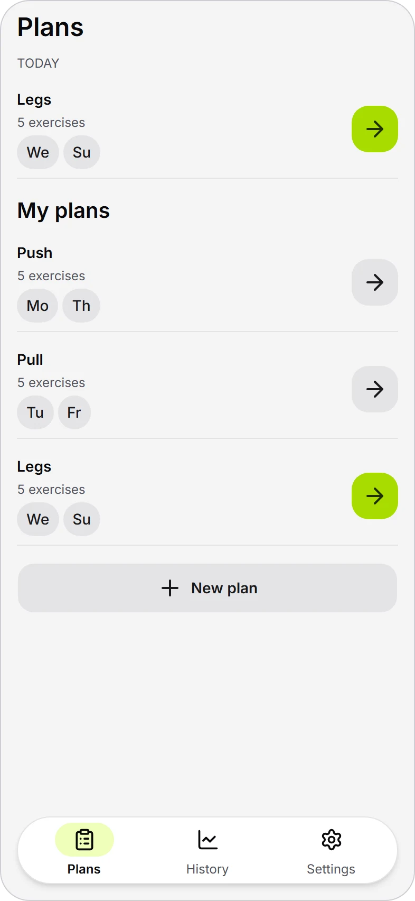
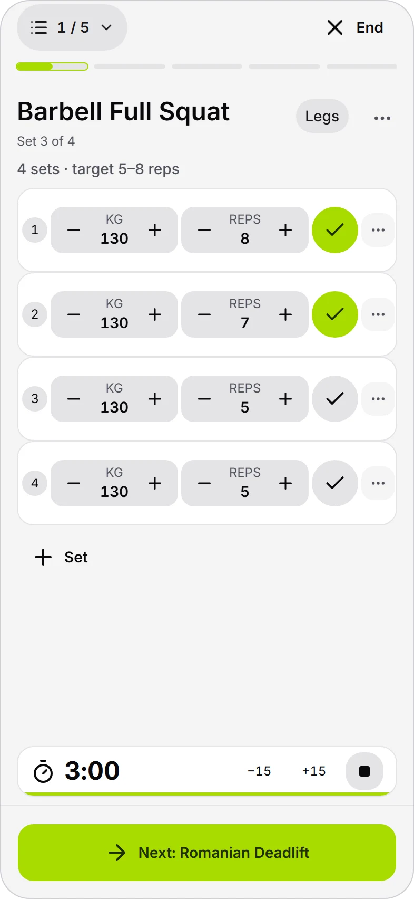
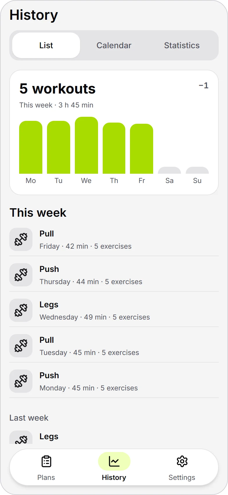
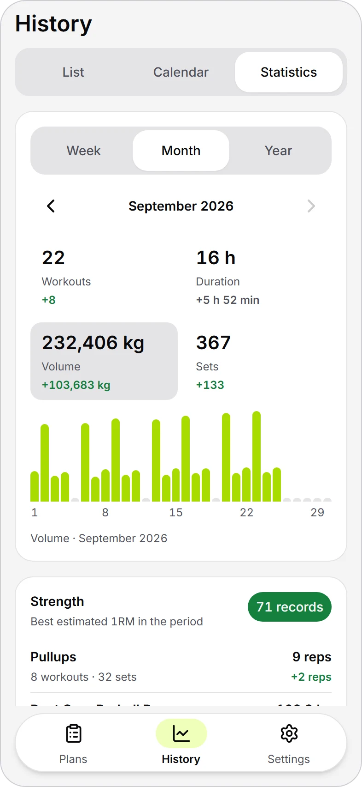
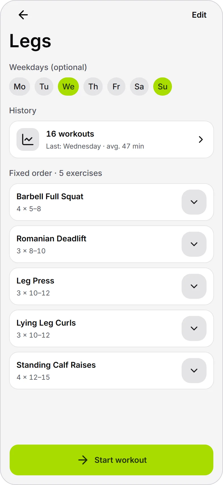
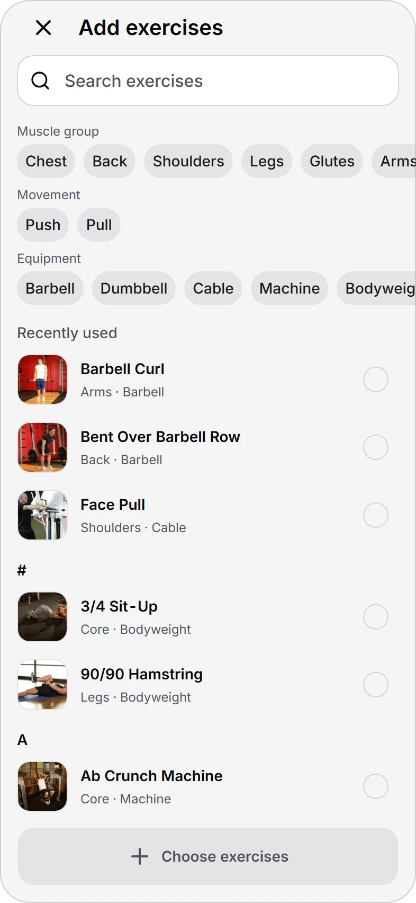
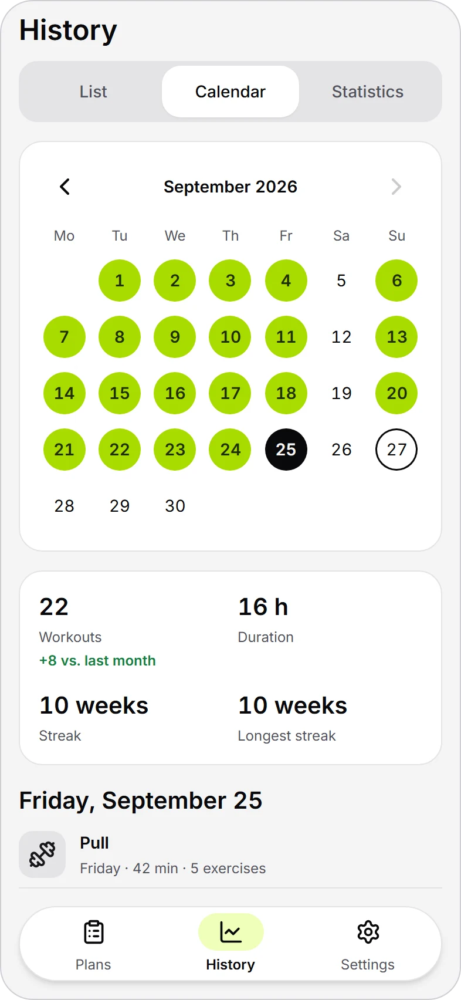
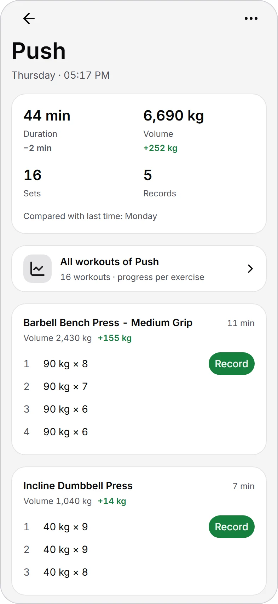
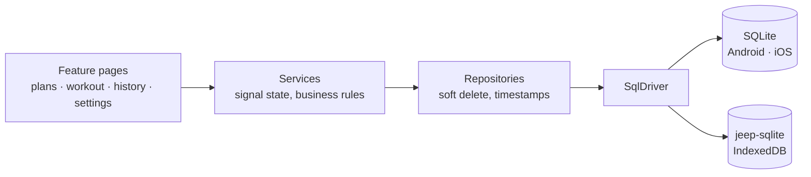

<div align="center">


# Grynd

**The strength training log that keeps up with you.**

Build your plans, log every set with a single tap and watch your progress grow.<br>
Free and offline-first. No ads, no subscription, no account.

[](https://github.com/mcalihe/grynd/actions/workflows/ci.yml)
[](https://github.com/mcalihe/grynd/releases/latest)
[](#get-grynd)
[](https://www.conventionalcommits.org)

[**Try it in your browser**](https://fit.michael-isler.com) ·
[Download for Android](https://github.com/mcalihe/grynd/releases/latest) ·
[Changelog](CHANGELOG.md) ·
[Roadmap](docs/roadmap.md)

<br>

<picture>
  <source media="(prefers-color-scheme: dark)" srcset="docs/readme/screenshots/plans-dark.webp">
  
</picture>
<picture>
  <source media="(prefers-color-scheme: dark)" srcset="docs/readme/screenshots/workout-dark.webp">
  
</picture>
<picture>
  <source media="(prefers-color-scheme: dark)" srcset="docs/readme/screenshots/history-dark.webp">
  
</picture>
<picture>
  <source media="(prefers-color-scheme: dark)" srcset="docs/readme/screenshots/stats-dark.webp">
  
</picture>

</div>

<br>

## Why Grynd?

Most workout trackers are either cluttered, locked behind a subscription or both. Grynd does one
thing: it gets out of your way between sets.

- **Faster than pen and paper.** Last time's weights and reps are already filled in. Check the
  value, tap once, done. The rest timer starts by itself.
- **Works anywhere.** Everything runs on your device. No signal in the basement gym? No problem.
- **Your data stays yours.** No account, no tracking, no analytics. Export a backup file whenever
  you like.
- **Progress you can see.** Personal records are detected automatically, and the history shows
  volume, strength per exercise, muscle groups and streaks.
- **Simple by design.** A plan is one workout, a fixed list of exercises. Running a split? Create one
  plan per day. That's the whole concept.

## Contents

[Features](#features) · [Get Grynd](#get-grynd) · [Development](#development) ·
[Architecture](#architecture) · [Contributing](#contributing) ·
[Releases and deployment](#releases-and-deployment) · [Documentation](#documentation) ·
[Privacy](#privacy) · [Acknowledgements](#acknowledgements) · [License](#license)

## Features

<table>
<tr>
<td width="50%" valign="top">

### Plans

- Create plans with exercises, sets, rep range and rest time
- Optional weekdays: today's plans show up first
- Reorder exercises with drag and drop
- **800+ exercises** with images, search and filters by muscle group, movement and equipment

</td>
<td width="50%" valign="top">

### Workout

- One exercise per page, swipe to move on
- Values from your last workout prefilled, **one tap per set**
- Change weight and reps with steppers or by swiping across the number
- Rest timer with a notification, even when the app is in the background
- Extra sets, duplicate sets, reorder exercises on the fly
- Celebrations for completed sets, exercises and personal records

</td>
</tr>
<tr>
<td width="50%" valign="top">

### History

- List, calendar and statistics views
- Weekly, monthly and yearly volume, duration and sets
- Estimated 1RM per exercise, muscle group split and streaks
- Compare every workout with the previous one of the same plan

</td>
<td width="50%" valign="top">

### Settings

- Light, dark or system theme
- kg or lb (stored in kg, converted for display only)
- English and German
- JSON backup export and restore
- Screen stays awake during a workout, haptics on native devices

</td>
</tr>
</table>

<details>
<summary><strong>More screenshots</strong></summary>
<br>
<div align="center">
<picture>
  <source media="(prefers-color-scheme: dark)" srcset="docs/readme/screenshots/plan-detail-dark.webp">
  
</picture>
<picture>
  <source media="(prefers-color-scheme: dark)" srcset="docs/readme/screenshots/picker-dark.webp">
  
</picture>
<picture>
  <source media="(prefers-color-scheme: dark)" srcset="docs/readme/screenshots/calendar-dark.webp">
  
</picture>
<picture>
  <source media="(prefers-color-scheme: dark)" srcset="docs/readme/screenshots/history-detail-dark.webp">
  
</picture>
</div>
</details>

## Get Grynd

Grynd is in early development (`0.x`). Things work, but expect changes.

| Platform | How to get it |
| --- | --- |
| **Web** | Open [fit.michael-isler.com](https://fit.michael-isler.com). Data is stored in your browser. |
| **Android** | Download `grynd-vX.Y.Z-debug.apk` from the [latest release](https://github.com/mcalihe/grynd/releases/latest) and install it ([how to](docs/release.md#debug-apk-auf-dem-android-gerät-installieren)). |
| **iOS** | Coming via TestFlight. CI already builds the iOS project on every release. |

App Store and Google Play listings will follow once signing is set up (see [docs/release.md](docs/release.md)).

## Development

### Prerequisites

- [Node.js 24](https://nodejs.org) (see [`.nvmrc`](.nvmrc))
- [pnpm](https://pnpm.io), activated through Corepack (the version is pinned in `package.json`)
- For native builds: [Android Studio](https://developer.android.com/studio) and/or Xcode

### Quick start

```bash
git clone https://github.com/mcalihe/grynd.git
cd grynd
corepack enable
pnpm install
pnpm start
```

Open [http://localhost:4200](http://localhost:4200). In the browser the SQLite database runs on
[jeep-sqlite](https://github.com/jepiqueau/jeep-sqlite) and is persisted in IndexedDB. Every shared
component is shown in all its states at
[http://localhost:4200/dev/components](http://localhost:4200/dev/components) (dev builds only).

### Scripts

| Command | Description |
| --- | --- |
| `pnpm start` | Dev server on port 4200 |
| `pnpm test` | Unit tests with Vitest (`pnpm test:watch` to watch) |
| `pnpm e2e` | End-to-end tests with Playwright on a phone-sized viewport |
| `pnpm lint` | ESLint (angular-eslint) |
| `pnpm format` | Prettier (`pnpm format:check` in CI) |
| `pnpm build` | Production build to `dist/grynd/browser` |
| `pnpm exec cap sync` | Copy the build into the Android and iOS projects |
| `pnpm catalog:import` | Rebuild the exercise catalog from free-exercise-db |
| `pnpm assets:generate` | Regenerate app icons and splash screens from `assets/` |

Before the first E2E run, install the browser once with `pnpm exec playwright install chromium`.

### Running on a device

```bash
pnpm build
pnpm exec cap sync
pnpm exec cap open android   # or: pnpm exec cap open ios
```

### Tech stack

| Area | Choice |
| --- | --- |
| Framework | [Angular](https://angular.dev) (standalone components, signals, new control flow) |
| Native shell | [Capacitor](https://capacitorjs.com) for Android and iOS |
| UI | [Spartan UI](https://spartan.ng) (brain + helm) and [Tailwind CSS v4](https://tailwindcss.com) |
| Icons | [Lucide](https://lucide.dev) via [ng-icons](https://ng-icons.github.io/ng-icons) |
| Animation | [Motion](https://motion.dev) and [canvas-confetti](https://github.com/catdad/canvas-confetti) |
| Database | SQLite via [@capacitor-community/sqlite](https://github.com/capacitor-community/sqlite) |
| i18n | [Transloco](https://jsverse.gitbook.io/transloco) (English, German) |
| Testing | [Vitest](https://vitest.dev) and [Playwright](https://playwright.dev) |
| Tooling | pnpm, angular-eslint, Prettier, GitHub Actions, release-please |

### Project structure

```text
src/app/
├── core/                 # data and business logic, no UI
│   ├── db/               # SQLite driver, migrations, repositories, catalog sync
│   ├── plans/            # plans and the plan editor draft
│   ├── workout/          # sessions, prefill, records, intervals, rest timer
│   ├── history/          # statistics and comparisons
│   ├── backup/           # JSON export and import
│   └── settings/ i18n/ services/ units/ utils/
├── features/             # routed pages: plans, workout, history, settings
└── shared/
    ├── ui/               # Spartan helm components
    ├── components/       # own components (set row, timer bar, charts, …)
    └── motion/           # animation presets and the celebration service
docs/                     # product plan, roadmap, decisions, design notes
e2e/                      # Playwright tests
scripts/                  # catalog import, screenshots, deployment
android/ ios/             # Capacitor native projects
```

## Architecture

Grynd has no backend. All data lives in a local SQLite database, and every screen reads it through
services that expose their state as Angular signals.



A few rules shape the code base:

- **A workout is a copy of its plan.** Reordering or adding sets during a workout never changes the
  plan.
- **Sync-ready records.** Every row has an app-generated UUIDv7 `id`, `createdAt`, `updatedAt` and
  `deletedAt` (soft delete), so a future sync needs no migration.
- **Time comes from timestamps.** Everything is stored in UTC, and durations are derived from
  timestamps. The rest timer stores its end time, not a counter.
- **One unit internally.** Weights are always stored in kg; lb exists only on screen.
- **Design tokens only.** Colors, spacing and radii come from the
  [Figma file](https://www.figma.com/design/iCoAOIvfyeCFYFU4Og7rVf/grynd) via generated CSS
  variables. Components mirror their Figma names.

Business logic such as prefill, record detection (estimated 1RM by Epley), intervals and
unsaved-changes detection is covered by unit tests. The main flow from plan to history is covered by
an end-to-end test.

## Contributing

Grynd is a personal project, but issues and ideas are welcome. Before you start on a pull request,
please open an issue so we can agree on the approach. [`CLAUDE.md`](CLAUDE.md) holds the full
working agreement; the short version:

1. Read [`docs/plan.md`](docs/plan.md) for the product decisions behind a feature.
2. Create a branch per change and keep commits small.
3. Use only Spartan helm components, design tokens and Transloco keys (no hardcoded colors or text).
4. Make sure `pnpm format:check`, `pnpm lint`, `pnpm test` and `pnpm e2e` pass.
5. Give the pull request a [Conventional Commits](https://www.conventionalcommits.org) title, for
   example `feat(workout): show the previous set while logging`. PRs are squash-merged and the title
   becomes the changelog entry, so CI checks it.

Every pull request gets its own preview deployment, linked in the PR.

<details>
<summary><strong>Updating the README screenshots</strong></summary>
<br>

With the dev server running (`pnpm start`), run:

```bash
node scripts/readme-screenshots.mjs
```

The script loads generated demo data, freezes the clock and writes light and dark screenshots to
`docs/readme/screenshots/`.

</details>

## Releases and deployment

Versioning is fully automated with [release-please](https://github.com/googleapis/release-please).
Every merge to `main` updates a release PR; merging that PR tags the version, publishes a
[GitHub release](https://github.com/mcalihe/grynd/releases) with the changelog and attaches the
Android APK.

| Environment | URL | Updated on |
| --- | --- | --- |
| Production | [fit.michael-isler.com](https://fit.michael-isler.com) | Every release |
| Staging | [fit-preview.michael-isler.com/main](https://fit-preview.michael-isler.com/main/) | Every merge to `main` |
| Preview | `fit-preview.michael-isler.com/pr-<number>/` | Every pull request |

Details on CI, native builds and signing are in [docs/release.md](docs/release.md).

## Documentation

Product and design documents are written in German.

| Document | Content |
| --- | --- |
| [docs/plan.md](docs/plan.md) | Product plan: scope, data model, business rules, screens |
| [docs/roadmap.md](docs/roadmap.md) | Milestones and tasks |
| [docs/decisions/](docs/decisions) | Short decision records |
| [docs/design/component-map.md](docs/design/component-map.md) | Figma components and screens mapped to code |
| [docs/release.md](docs/release.md) | Versioning, builds, deployment and store setup |
| [docs/store/](docs/store) | Store listing and privacy policy drafts |

## Privacy

Grynd collects no data. There is no account, no analytics and no server that stores your workouts.
Plans and workouts never leave your device unless you export a backup yourself. The full privacy
policy draft is in [docs/store/privacy.md](docs/store/privacy.md).

## Acknowledgements

- Exercise data and images from [free-exercise-db](https://github.com/yuhonas/free-exercise-db)
  (public domain)
- [Spartan](https://spartan.ng), [Lucide](https://lucide.dev) and [Inter](https://rsms.me/inter/)
  for the UI building blocks
- [Angular](https://angular.dev) and [Capacitor](https://capacitorjs.com) for making one code base
  run everywhere

## License

No license has been chosen yet, so all rights are reserved for now. Please open an issue if you
would like to use the code.

<div align="center">
<br>
<sub>Made with ☕ in Switzerland</sub>
</div>
